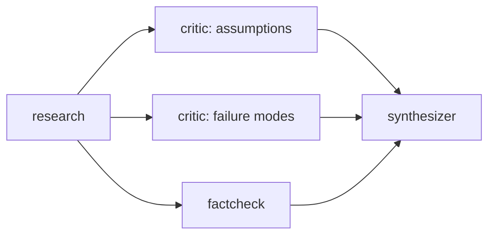

<div align="center">


# Crucible

**Multi-agent collaboration with a memory that actually remembers.**

Agents research, attack each other's conclusions, and adjudicate - over a shared,
searchable, self-compacting memory that survives across sessions.

[](https://github.com/Abdur-Rafay-AR/crucible/actions/workflows/ci.yml)
[](https://www.python.org/downloads/)
[](LICENSE)
[](pyproject.toml)
[](#models)

[Quickstart](#quickstart) · [Why](#why-this-exists) · [How it works](#how-it-works) · [CLI](#cli) · [Python API](#python-api) · [Docs](docs/)

</div>

---

## Why this exists

Most "multi-agent" demos are one model called in a loop with the transcript pasted
back in. Two things break immediately: the transcript outgrows the context window,
and the agents never really disagree - they politely restate each other.

Crucible attacks both problems directly.

**Memory is a real retrieval system, not a transcript.** Every contribution is an
immutable, typed entry in a SQLite database. Recall blends BM25 full-text search,
embedding similarity, exponential recency decay and per-entry salience, then drops
near-duplicates with MMR and fits the result to a token budget. When a topic
outgrows that budget, older entries are folded into a durable summary and archived:
never deleted, and reversible.

**Disagreement is structural.** The critic literally cannot see its own previous
critiques, so it cannot re-litigate them. In debate mode each agent must explicitly
`CONCEDE`, `SHARPEN` or `HOLD` against the other's latest position, and the debate
stops once round-to-round cosine similarity shows positions have actually stopped
moving - measured convergence, not a fixed round count.

And it runs on your laptop. The core engine has **zero dependencies** - standard
library only - and the default model is a local one through Ollama.

```
$ crucible run "Is refining capacity the real EV bottleneck by 2030?" \
    --topic batteries --preset red-team

  ▶ red-team · 5 nodes · topic 'batteries'
  · research: Research Analyst working…
  ✓ research: done in 4.1s (812 tokens)
  · critic_assumptions: Devil's Advocate working…      ┐
  · critic_failure_modes: Devil's Advocate working…    ├─ running in parallel
  · factcheck: Fact Checker working…                   ┘
  ✓ critic_assumptions: done in 6.7s (1,104 tokens)
  ✓ critic_failure_modes: done in 7.2s (1,233 tokens)
  ✓ factcheck: done in 5.9s (642 tokens)
  · synthesizer: Adjudicator working…
  ✓ synthesizer: done in 8.8s (1,447 tokens)
  ▽ memory compacted: folded 11 entries into one summary (14,203 → 3,908 tokens)
  ■ succeeded in 27.1s · 5,238 tokens
```

---

## Quickstart

```bash
pip install -e ".[ui,api]"
```

**Try it with no model at all.** The `echo` provider is deterministic and offline:
it exercises the entire system, so you can see the machinery before committing to a
download:

```bash
crucible run "Does compute scaling still predict capability?" \
  --topic scaling --preset brief --model echo:test
```

**Then point it at a real model.** Local, free, private:

```bash
ollama pull llama3.1
crucible run "Does compute scaling still predict capability?" --topic scaling
```

Or a hosted one:

```bash
export CRUCIBLE_MODEL=openai:gpt-4o-mini
export CRUCIBLE_OPENAI_API_KEY=sk-...
```

**Launch the control room:**

```bash
crucible ui        # Streamlit app on :8501
crucible serve     # REST + SSE API on :8000, docs at /docs
```

Something not working? `crucible doctor` checks your provider, database,
full-text index and optional extras, and tells you what to do about each.

---

## How it works

### The run

A run is a **DAG of agent invocations**, executed level by level. Everything in one
level runs concurrently in a thread pool; dependents wait.



If a node fails, only *its* downstream branch is skipped - unrelated branches finish
and the run reports `partial` rather than throwing away good work. Memory is written
as each agent completes, so even a cancelled run keeps what it learned.

### The memory

```
                 ┌───────────────── recall ─────────────────┐
  your question ─►  BM25 · embeddings · recency · salience   │
                 │        ↓ normalise and weight             │
                 │        ↓ MMR de-duplicate                 │
                 │        ↓ fit to token budget              │
                 └─────────────────┬────────────────────────┘
                                   ▼
                         agent prompt ──► model ──► new typed entry
                                   │
                      over budget? ▼
                         fold oldest entries into a summary,
                         archive the originals (reversible)
```

Every recalled entry keeps its score breakdown, so you can always ask *why* a memory
surfaced:

```bash
$ crucible recall "water usage" --topic batteries --explain

research · research · 2026-07-24 09:12
  score=0.812 (kw=1.00 sem=0.74 rec=0.61 sal=0.60)
  Lithium brine extraction in Chile's Atacama consumes roughly 500,000 litres…
```

That single flag is the difference between a retrieval system you can tune and a
black box you have to trust.

### The agents

| Agent | Role | What makes it different |
|---|---|---|
| `research` | Research Analyst | Tags every claim `(high/medium/low)` confidence; must state what it *couldn't* determine |
| `critic` | Devil's Advocate | Steelmans first, then attacks; **cannot see its own past critiques** |
| `factcheck` | Fact Checker | Emits `CONTRADICTION` / `UNSUPPORTED` / `IMPRECISE` / `STALE` verdicts against memory |
| `insight` | Strategic Analyst | Second-order effects and leverage points; a restatement is a failure |
| `synthesizer` | Adjudicator | Must *decide*, not split the difference; ends with a falsifiable bottom line |
| `summarizer` | Synthesis Editor | Compresses while **preserving disagreement** by name |
| `planner` | Planner | Dependency-ordered steps, each with a success test |

Each agent has its own **recall policy** - the critic sees claims to attack, the
summarizer sees everything, the planner mostly sees conclusions. Feeding every agent
the same context is the easiest way to get seven bland restatements.

### Presets

| Preset | Shape | Cost |
|---|---|---|
| `brief` | research → summarizer | low |
| `research-critique-synthesis` | research → (critic ∥ factcheck) → synthesizer | medium |
| `red-team` | research → 2 independent critics ∥ factcheck → synthesizer | high |
| `deep-dive` | everything, ending in a plan | high |
| `catch-up` | no new research - just report where the topic stands | low |
| `solo:<agent>` | any single agent | low |

---

## CLI

```bash
crucible run "question" --topic t [--preset red-team] [--model ollama:llama3.1]
crucible debate "question" --topic t --rounds 4    # stops early on convergence
crucible recall "query" --topic t --explain        # inspect retrieval ranking
crucible timeline --topic t [--all]                # full audit trail
crucible runs | topics | stats                     # what happened, what it cost
crucible export --topic t --format md -o report.md
crucible graph red-team --format mermaid           # render any workflow
crucible agents | presets | doctor | reindex
crucible serve | ui
```

Every command accepts `--json`, so the whole thing is scriptable:

```bash
crucible run "..." --topic t --json | jq -r '.results.synthesizer.content'
```

---

## Python API

```python
from crucible import Orchestrator, Settings, SqliteMemoryStore, build_preset

settings = Settings.from_env(model="ollama:llama3.1")
store = SqliteMemoryStore("data/crucible.sqlite3")
orchestrator = Orchestrator(store, settings=settings)

report = orchestrator.run(
    build_preset("red-team", settings=settings),
    topic="batteries",
    query="Is refining capacity the real bottleneck by 2030?",
)

print(report.output())  # the adjudicated conclusion
print(report.usage.total_tokens)  # what it cost
print(report.results["critic_assumptions"].content)
```

**Build your own workflow:**

```python
from crucible import AgentGraph

graph = (
    AgentGraph(name="my-review")
    .then("research")
    .parallel("critic", "factcheck")
    .then("synthesizer")
    .then("planner")
)
report = orchestrator.run(graph, topic="t", query="...")
```

**Add your own agent** - a role, a recall policy and a prompt:

```python
from crucible.agents import Agent, RecallPolicy, register_agent
from crucible.memory import EntryKind


@register_agent
class EconomistAgent(Agent):
    name = "economist"
    role = "Economist"
    entry_kind = EntryKind.INSIGHT
    temperature = 0.4
    recall_policy = RecallPolicy(kinds=(EntryKind.RESEARCH, EntryKind.SYNTHESIS), max_entries=8)

    @property
    def system_prompt(self) -> str:
        return (
            "Economist.\n"
            "Reframe the question in terms of incentives, elasticity and second-order "
            "cost effects. Name who bears each cost."
        )
```

It is now available to the CLI, API and UI. Third-party packages can ship agents
through the `crucible.agents` entry-point group with no changes here.

**Subscribe to run events** (this is what drives the CLI trace, the SSE stream and
the live UI):

```python
orchestrator.bus.subscribe(lambda e: print(e.type.value, e.node, e.message))
```

---

## Models

Set `CRUCIBLE_MODEL` to `provider:model`:

| Provider | Example | Notes |
|---|---|---|
| `ollama` | `ollama:llama3.1` | **Default.** Local, free, private |
| `openai` | `openai:gpt-4o-mini` | Needs `CRUCIBLE_OPENAI_API_KEY` |
| `anthropic` | `anthropic:claude-sonnet-4-5` | Needs `CRUCIBLE_ANTHROPIC_API_KEY` |
| `groq`, `together`, `deepseek`, `openrouter`, `mistral`, `fireworks` | `groq:llama-3.3-70b` | OpenAI-compatible; base URLs preconfigured |
| `lmstudio`, `vllm`, `llamacpp` | `vllm:my-model` | Local OpenAI-compatible servers |
| `echo` | `echo:test` | Deterministic, offline - for tests and demos |

All providers speak HTTP through `urllib`. No SDKs, no version conflicts.

---

## Configuration

Copy `.env.example` to `.env`. Everything has a sensible default; the knobs worth
knowing:

| Variable | Default | What it does |
|---|---|---|
| `CRUCIBLE_MODEL` | `ollama:llama3.1` | Provider and model |
| `CRUCIBLE_CONTEXT_TOKEN_BUDGET` | `6000` | Max tokens of memory injected per prompt |
| `CRUCIBLE_COMPACTION_THRESHOLD_TOKENS` | `12000` | When a topic gets compacted |
| `CRUCIBLE_RECALL_W_KEYWORD` / `_SEMANTIC` / `_RECENCY` / `_SALIENCE` | `1.0` / `1.0` / `0.6` / `0.4` | Retrieval signal weights |
| `CRUCIBLE_RECALL_MMR_LAMBDA` | `0.7` | 1.0 = pure relevance, 0.0 = pure diversity |
| `CRUCIBLE_DEBATE_CONVERGENCE` | `0.92` | Similarity at which a debate stops early |
| `CRUCIBLE_MAX_PARALLEL_AGENTS` | `4` | Thread pool size |
| `CRUCIBLE_WEB_SEARCH_ENABLED` | `false` | Network egress is opt-in |

---

## Design notes

A few decisions that are load-bearing, explained in full in
[`docs/ARCHITECTURE.md`](docs/ARCHITECTURE.md):

- **Zero core dependencies.** SQLite, `urllib` and `dataclasses` do the work. A
  project you can only run after a 600 MB download is a project most people never
  run. FastAPI and Streamlit are optional extras.
- **SQLite over a vector database.** A topic holds thousands of entries, not
  millions. SQLite gives durable transactions, real BM25 via FTS5, and a single-file
  artifact you can copy and inspect - with nothing to operate.
- **Offline embeddings by default.** A deterministic signed-hashing embedder over
  word and character n-grams. Weaker than a transformer, but it is the *second*
  signal behind BM25, it needs no download, and `CallableEmbedder` swaps in a real
  model in one line.
- **A text tool protocol, not native function calling.** Local models support
  function calling unevenly. Models emit `TOOL: name {json}`; parsing is lenient and
  every failure returns to the model as a readable observation instead of raising.
- **Threads, not asyncio.** Every provider call is blocking HTTP and every store
  write is blocking `sqlite3`. A thread pool matches that without forcing async
  through the whole codebase.

---

## Development

```bash
pip install -e ".[dev,ui,api]"
pytest                    # 176 tests, fully offline
pytest --cov=crucible
ruff check . && mypy src
```

Type checking is enforced in CI, not advisory. The suite never touches the network: it runs against the deterministic `echo`
provider and temporary SQLite files. Store tests are a conformance suite
parametrised over both the SQLite and in-memory implementations.

Contributions welcome - see [`CONTRIBUTING.md`](CONTRIBUTING.md).

## License

MIT © Abdur Rafay
